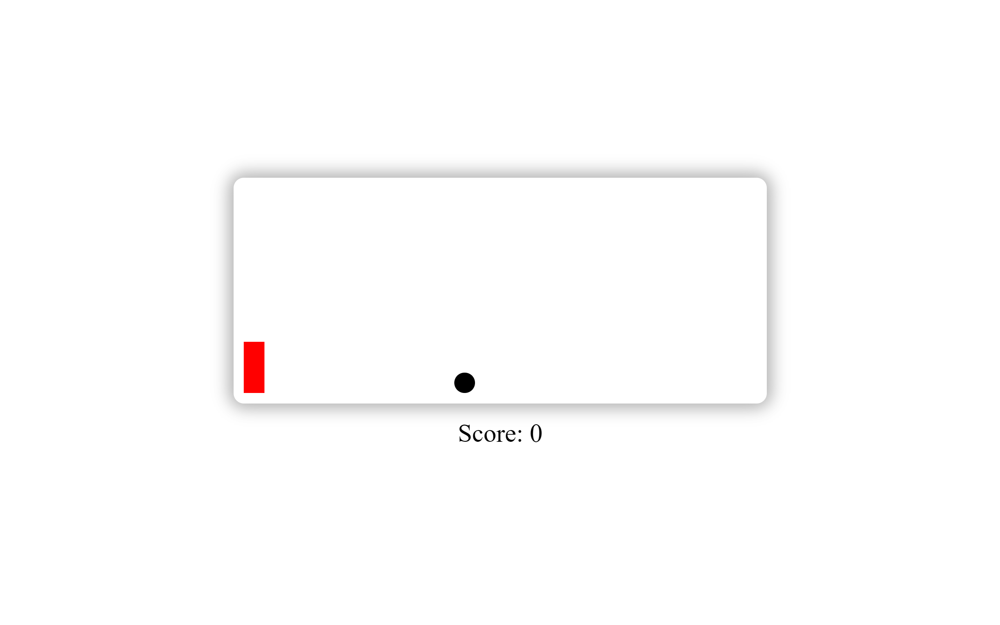

# Simple Jump Game
> Built using Javascript and HTML, CSS

# Rules
- A ball will be rolling towards block present to the left
- Block can move only in y-direction whenever the user clicks left mouse button
- After some milli seconds automatically it comes back to its original position
- Score will be calculated on the basis of survival time (Played time without collision)
